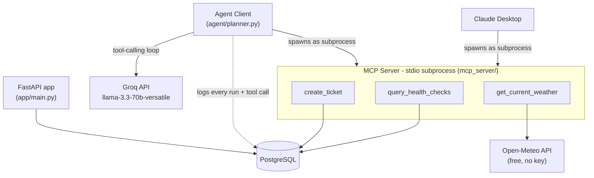

# MCP Tool Agent

A custom [MCP (Model Context Protocol)](https://modelcontextprotocol.io/) server exposing database, ticketing, and external-API tools to both **Claude Desktop** and a **self-built autonomous agent** powered by Groq's free-tier LLaMA 3.3. The agent plans multi-step tasks, calls tools in sequence, recovers from failures instead of crashing, and logs every decision to PostgreSQL for full traceability.

Built version by version (v0–v7), each one a fully working, committed, tested state of the project - see [Build history](#build-history) below.

## Architecture



Two things worth understanding about this shape, both decided (and in one case, corrected) during the build - see the [MCP Server Basics](#v1--mcp-server-basics) and [Infrastructure](#v6--infrastructure) sections below for the full reasoning:

- **There's no standalone MCP server container.** MCP's stdio transport means a server has no persistent stdin to read from without a client attached to it directly - so the MCP server only ever runs as a subprocess *of* whichever client launched it (Claude Desktop, or the agent).
- **The MCP server runs two different ways** depending on who's asking: on your host machine via a local virtual environment (required for Claude Desktop, which must spawn local processes directly), or fully containerized inside the `agent` Docker service (for everything else - demos, CI, anyone cloning the repo without wanting local Python setup at all).

## What it does

1. The MCP server exposes three tools: a read (`query_health_checks`), a write (`create_ticket`), and a real external API call (`get_current_weather`, via Open-Meteo).
2. The agent takes a task in plain English, asks Groq/LLaMA 3.3 what to do, executes whatever tool it picks, feeds the result back, and repeats until the model has a final answer instead of another tool call.
3. If a tool call fails, the agent doesn't crash - it's told explicitly and re-plans (fixes input, tries a different approach) instead of blindly repeating the same failing call, bounded by a consecutive-failure cap so it never loops forever.
4. Every run and every tool call - inputs, outputs, success/failure - is logged to Postgres as it happens, so a run is fully traceable afterward, not just visible while you're watching the terminal.

## Project structure

```
mcp-tool-agent/
├── app/                        FastAPI service - liveness/readiness checks, shared DB layer
│   ├── config.py                 typed settings (Postgres connection)
│   ├── database.py                pooled SQLAlchemy engine + session factory
│   ├── models.py                   HealthCheck, Ticket, AgentRun, ToolCall
│   └── main.py                      /, /health, /health/db endpoints
├── mcp_server/                  the MCP server - exposes tools over stdio
│   ├── instance.py                shared FastMCP instance
│   ├── types.py                    shared ToolError shape
│   ├── server.py                    entrypoint (python -m mcp_server.server)
│   └── tools/
│       ├── db_query.py               read: query_health_checks
│       ├── ticket_create.py          write: create_ticket
│       └── external_api.py           external call: get_current_weather
├── agent/                       the autonomous agent
│   ├── client.py                  MCP connection + MCP-to-Groq schema adapter
│   ├── config.py                    separate settings (GROQ_API_KEY only)
│   └── planner.py                    the agent loop itself
├── scripts/                     runnable entrypoints
│   ├── run_agent_task.py          give the agent a task
│   ├── show_run_history.py         query a run's full trace from Postgres
│   ├── apply_schema.py             idempotent schema application
│   └── test_mcp_tools.py           manual MCP smoke test (all 3 tools)
├── tests/                       automated test suite (pytest)
│   ├── test_tools.py               unit: tool functions called directly
│   └── test_mcp_protocol.py         integration: through the real MCP protocol
├── db/init.sql                  schema (health_check, tickets, agent_runs, tool_calls)
├── docker-compose.yml           db + app services; agent service (profile-gated)
├── Dockerfile                   shared image for app and agent services
└── .github/workflows/ci.yml     tests + docker build, on every push
```

## Setup

- Docker Desktop
- Python 3.10+ (only needed locally for the Claude Desktop / MCP dev path - see below)
- A free [Groq API key](https://console.groq.com)

```bash
git clone <this-repo>
cd mcp-tool-agent
cp .env.example .env   # then add your GROQ_API_KEY
docker compose up -d   # starts db + app
```

## Environment variables

All in `.env` (never committed - see `.env.example` for the template):

| Variable | Required for | Notes |
|---|---|---|
| `POSTGRES_USER` | everything | matches the Postgres container's user |
| `POSTGRES_PASSWORD` | everything | matches the Postgres container's password |
| `POSTGRES_DB` | everything | database name |
| `POSTGRES_HOST` | everything | `localhost` for anything run on your host (venv, tests); Docker Compose overrides this to `db` for the containerized `app`/`agent` services automatically - you never need to change it yourself |
| `POSTGRES_PORT` | everything | `5432` (default) |
| `GROQ_API_KEY` | the agent only | free at [console.groq.com](https://console.groq.com); the FastAPI app never needs this - see `agent/config.py` |

## Running it

**The passive foundation** (FastAPI + Postgres):
```bash
docker compose up -d
curl http://localhost:8000/health/db
```

**The agent, fully containerized** (MCP server included, no local setup):
```bash
docker compose run --rm agent
docker compose run --rm agent python -m scripts.run_agent_task "your task here"
```

**The agent's full history**, queried straight from Postgres:
```bash
docker compose run --rm agent python -m scripts.show_run_history
```

**Local development** (only needed for the Claude Desktop integration, which must launch the MCP server directly on your machine):
```bash
python3.11 -m venv .venv && source .venv/bin/activate
pip install -r requirements.txt
python -m scripts.test_mcp_tools     # smoke-test all 3 tools directly
```

**Tests:**
```bash
source .venv/bin/activate
pytest -v
```

## Example agent runs

These are real, verified runs from this project's own build process - not fabricated examples.

**Multi-step task, two tools in sequence, decided autonomously by the model:**

```
Task: Check the current weather in Austin. If the temperature is above 30 degrees
Celsius, create a high-priority support ticket titled 'Server room cooling check'...

[agent] iteration 1: calling get_current_weather({'city': 'Austin'})
[agent] iteration 1: result = {'temperature_c': 36.0, 'conditions': 'Mainly clear', ...}
[agent] iteration 2: calling create_ticket({'title': 'Server room cooling check', 'priority': 'high', ...})
[agent] iteration 2: result = {'id': 4, 'status': 'open', ...}
[agent] iteration 3: final answer

Final answer: The current temperature in Austin is 36.0 degrees Celsius. Since it is
above 30 degrees Celsius, a high-priority support ticket titled 'Server room cooling
check' has been created to check the server room's cooling system. The ticket ID is 4.
```

The same task pointed at a cold city (Reykjavik, 10.7°C) correctly reports the temperature and creates no ticket - the branching is real, driven by actual tool data, not a scripted path.

**Genuine failure, real recovery - not a retry, a re-plan:**

```
Task: Look up the current weather in 'Zzyzxville'. If that fails, look up the
weather in Paris instead and report its temperature.

[agent] iteration 1: calling get_current_weather({'city': 'Zzyzxville'})
[agent] iteration 1: FAILED (consecutive failures: 1) -> No location found matching 'Zzyzxville'
[agent] iteration 2: calling get_current_weather({'city': 'Paris'})
[agent] iteration 2: result = {'temperature_c': 19.4, 'conditions': 'Clear sky', ...}
[agent] iteration 3: final answer

Final answer: The current weather in Paris is 19.4 degrees Celsius with a clear sky.
```

Full details on every design decision, including two real bugs found by actually running the containerized system (not just reading the config), are in `INTERVIEW_PREP.md`.

## Build history

| Version | What it added |
|---|---|
| v0 | FastAPI + PostgreSQL, pooled connections, Docker Compose |
| v1 | MCP server basics - one tool, verified over the real stdio protocol |
| v2 | Ticket creation (write) and weather lookup (external API) tools |
| v3 | The agent itself - Groq/LLaMA 3.3 loop calling tools autonomously |
| v4 | Explicit failure detection and bounded re-planning |
| v5 | Every run and tool call logged to Postgres, fully traceable |
| v6 | Automated tests, containerized agent, GitHub Actions CI |
| v7 | This README, code cleanup, `INTERVIEW_PREP.md` |
